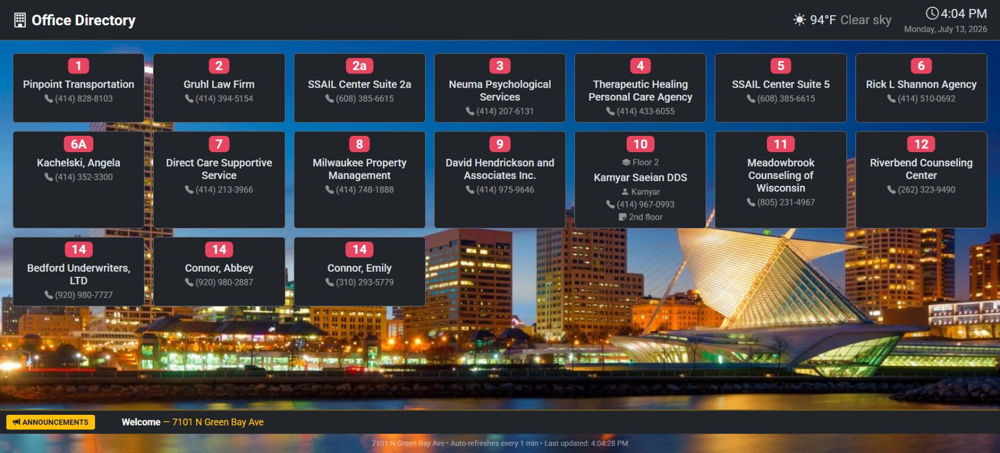

## Background  
[Kamyar Saeian DDS](https://share.google/E5XbdycNLDJ3Fg2nl) who is my dentist asked for a Kiosk program that they can use when they move to a new building. They told other companies charge $100+ per month for a hardware + initial setup and they asked me custom solution.


## How to:
I wrote a custom C# + Blazor application driven by a Raspberry Pi 4B (2GB RAM) connected to a TV to show the display. The office bought the Pi themselves, and I set it up so it runs entirely off the TV -- powered from the TV's USB port, so there is no extra power brick or cable to worry about. When the TV turns on, the Pi boots; when it turns off, so does the Pi. The admin side (managing offices, announcements, and advertisements) is a Blazor WebAssembly app, but Blazor WASM is too heavy to run smoothly on a low-powered Pi. So the actual `/display` route that the TV shows is a plain server-rendered Razor Page -- no WASM download, no client-side framework, just HTML and a sprinkle of vanilla JavaScript. It pulls together time and date, weather ([OpenMeteo](https://open-meteo.com)), holidays ([API Ninja](https://api-ninjas.com)), a city background image, an announcement ticker, the office directory, and rotating advertisements.

The stack is straightforward:

- .NET + Razor Pages for the `/display` output, Blazor WebAssembly + Bootstrap 5 for the admin UI



## Handling refresh

A kiosk has to stay fresh without anyone touching it, and it also has to survive the network dropping out -- which, in a building that just moved, happens more than you would think.

The display refreshes itself with a JavaScript timer rather than a hard `<meta http-equiv="refresh">`. The reason is the advertisement overlay: I never want the page to reload in the middle of an ad. So the refresh timer is cancelled while an ad is showing and rescheduled once the ad finishes.

```js
function scheduleRefresh() {
    refreshTimer = setTimeout(function () { location.reload(); }, REFRESH_INTERVAL);
}

function cancelRefresh() {
    if (refreshTimer) { clearTimeout(refreshTimer); refreshTimer = null; }
}
```

The refresh interval, ad interval, and ad duration are all configurable from the admin UI, so the office can tune how chatty the screen is without a redeploy.

## Keeping the Pi alive

Client-side timers are fine when the site is up, but if the server or the network goes down, Chromium just parks itself on an error page and stays there. Nobody is going to walk over and hit F5 on a wall-mounted TV. So the Pi runs its own watchdog.

The whole thing is provisioned by a single [`setup.sh`](https://github.com/amir734jj/kiosk/blob/master/setup/setup.sh) that installs Chromium in kiosk mode, forces 1080p output (the Pi loves to default to 4K on capable displays), disables screen blanking, hides the mouse cursor, and wires up autostart:

```bash
exec chromium \
    --noerrdialogs \
    --disable-infobars \
    --kiosk \
    --disable-session-crashed-bubble \
    --no-first-run \
    --start-fullscreen \
    "$URL"
```

The interesting part is the watchdog script. It polls the display URL and reacts with escalating force so it never hammers a site that is genuinely down.

On top of that, a cron job restarts Chromium every night at 4am and updates it weekly, so the browser never gets a chance to slowly leak memory over weeks of uptime.

```bash
# Weekly Chromium update + reboot (Sunday 3am)
0 3 * * 0 sudo apt-get update -qq && sudo apt-get upgrade -y -qq chromium && sudo reboot
# Daily Chromium restart (4am) -- the watchdog relaunches it automatically
0 4 * * * /opt/kiosk/restart.sh
```

## Wrap up

The office avoided the recurring monthly fee the other vendors wanted. This runs on a cheap Raspberry Pi they bought once, powered straight off the TV's USB, with the software doing the boring work of keeping itself alive. It was a fun little project that scratched the "make hardware do something useful" itch, and my dentist gets a slick office directory out of it.

