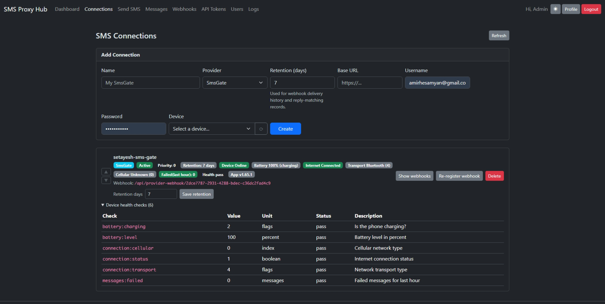

## Background

I needed to send and receive a small number of SMS messages from an application. Twilio seemed like the obvious choice, but getting a number ready for application traffic was much more involved than I expected.

For a toll-free number or A2P 10DLC campaign, the verification process asks for exact legal business information that matches public records, a clear description of the messaging use case, proof that end users explicitly opted in, and a compliant privacy policy that explains how SMS data is handled. Those requirements make sense for controlling spam, but they are a lot of overhead for a small project, and approval is not guaranteed. I went back and forth for months. Literally months. No success. I gave up.

## The Alternative

I had a old Android phone and bought a Tello plan for about $6 per month. The phone already had everything I needed: a real phone number, access to internet, and the ability to send and receive SMS.

I installed [SmsGate](https://sms-gate.app/) on it, which exposes the phone's messaging capabilities through an API. That solved the device side, but I still needed a clean way (via api-key + webhook callback with payload) for my applications to send messages, receive replies, and associate each reply with the operation that initiated the conversation.

That became [**SMS Proxy Hub**](https://github.com/amir734jj/sms-proxy-hub).



## How It Works

SMS Proxy Hub is a self-hosted ASP.NET Core service that sits between an application and an SMS provider. Its main pieces are:

- An ASP.NET Core API backed by PostgreSQL
- A Blazor UI for managing connections, API tokens, and webhooks
- SmsGate support for sending through an Android phone
- A Twilio provider, so the same API can still use Twilio when appropriate
- A .NET client package for applications that need to send messages

An application sends a phone number, message, and optional JSON payload to the hub. The hub forwards the message to SmsGate, which sends it through the Android phone and its Tello plan.

When a delivery event or reply arrives, the flow runs in reverse. SmsGate calls the hub, and the hub posts a webhook to the originating application. SMS and MMS replies are both supported.

```text
Application -> SMS Proxy Hub -> SmsGate -> Android phone -> Mobile network
Application <- Webhook ------- SMS Proxy Hub <- Reply ----- Android phone
```

## Matching Replies

Reply correlation was the most useful part to build into the proxy. A caller can attach any JSON payload when sending a message:

```json
{
	"appointmentId": 123,
	"patientId": "abc"
}
```

When the recipient replies, SMS Proxy Hub finds the most recent unanswered outbound message to that number and includes the original payload in the webhook. The application can understand the reply without maintaining a separate lookup table just for SMS state.

The hub also reports sent and failed events, automatically registers provider webhooks when a connection is created, and supports multiple connections. Applications only need to know the hub's API; provider-specific behavior stays behind it.

## Tradeoffs

This setup is not a drop-in replacement for Twilio at every scale. It depends on a physical phone being powered, connected, and healthy. A low-cost mobile plan has usage limits and is not intended for high-volume campaigns. There is also more infrastructure to operate: the API, database, Android device, and SmsGate installation all need monitoring.

It also does not remove the responsibility to obtain consent, honor opt-outs, protect phone-number data, or follow carrier rules. It changes the transport and removes a vendor onboarding bottleneck; it does not make unwanted messaging acceptable.

For my use case, those tradeoffs are reasonable. I get a real number, two-way SMS and MMS, webhook callbacks, and an API that I control for roughly the cost of a cheap phone plan.

## What I Learned

Sometimes the simplest alternative to a cloud service is a small piece of hardware that already does the job. An old Android phone is not as elegant as a fully managed messaging platform, but wrapping it behind a provider-neutral API makes the rest of the system clean and leaves room to switch providers later.

More importantly, the proxy turned a one-off workaround into a reusable boundary. My applications no longer care whether a message is sent by Twilio or by a phone sitting on my desk. They send a message, receive a webhook, and keep moving.

