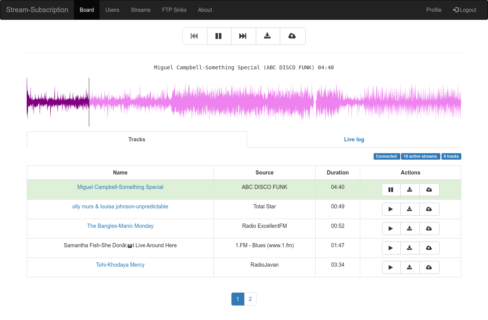

## Background

Online radio stations (IceCast/Shoutcast streams) play a continuous audio feed, but they don't hand you the individual songs. I wanted a way to "subscribe" to a station and have every track it plays land in my music library as a properly tagged MP3 -- without downloading and storing anything myself.

This turned into a few projects that build on each other: a low-level ripping library, a directory crawler, a backend service, and a web UI. You can try the live app at [stream.coolify.hesamian.com](https://stream.coolify.hesamian.com/).



## Stream-ripper (the library)

At the bottom of the stack is [Stream-ripper](https://github.com/amir734jj/Stream-ripper), a C# library published on [NuGet](https://www.nuget.org/packages/StreamRipper/). It connects to an IceCast stream, reads the inline metadata, and splits the continuous byte stream into separate songs -- firing an event each time a track changes so you can save it as its own MP3.

The API is event driven:

```csharp
var streamRipper = StreamRipperFactory.New(new StreamRipperOptions
{
    Url = new Uri("https://your-radio.example/stream"),
    MaxBufferSize = 10 * 1000000 // stop a song if it passes 10 MB
});

streamRipper.SongChangedEventHandlers += async (_, arg) =>
{
    var filename = $"{arg.SongInfo.SongMetadata}";
    await arg.SongInfo.Stream.ToFileStream($@"\Music\ripped\{filename}.mp3");
};

streamRipper.Start();
```

It exposes hooks for the whole lifecycle -- `OnStreamStarted`, `OnMetadataChanged`, `OnStreamUpdate`, `OnSongChanged`, and `OnStreamEnded` -- and wraps every handler as async under the hood.

## shoutcast-directory-crawler (finding stations)

Before you can subscribe to a station you need to know it exists. [shoutcast-directory-crawler](https://github.com/amir734jj/shoutcast-directory-crawler) is a small Node.js scraper that crawls [directory.shoutcast.com](https://directory.shoutcast.com/) and pulls out each station's metadata -- name, genre, bitrate, listener count, and stream URL -- into a big JSON catalog.

I wrote it because I asked SHOUTcast for an API key and never heard back after months, so scraping the public directory was the pragmatic way to get a station list to feed into the app.

## stream-subscription-api (the backend)

[stream-subscription-api](https://github.com/amir734jj/stream-subscription-api) turns the library into a real service. You give it a stream URL and credentials for a file-sharing target, and it rips the stream into MP3s and uploads each finished song to your storage (FTP, Dropbox, and friends). The service never keeps the files -- it only stores them where you told it to.

It's a .NET app that leans on a few things:

- [Stream-ripper](https://github.com/amir734jj/Stream-ripper) to do the actual ripping
- SignalR to push live logs and now-playing info to the browser in real time
- ReactiveX to manage the concurrency of multiple subscriptions
- Entity Framework Core as the ORM
- ASP.NET Identity for authentication

## stream-subscription-ui (the frontend)

[stream-subscription-ui](https://github.com/amir734jj/stream-subscription-ui) is the Angular front-end where you manage your subscriptions and watch songs get ripped live. It's built with Angular 8, Angular Material, and ngx-bootstrap, and talks to the backend over SignalR so the log and current track update as they happen.

A couple of fun touches:

- [Wavesurfer.js](https://wavesurfer.xyz/) renders the audio waveform for playback in the browser
- The Media Session API wires up lock-screen controls and Android Auto / Apple CarPlay integration, so it behaves like a proper media app on a phone

## Wrap up

What started as "I wish I could grab songs off this radio station" grew into a reusable NuGet library and a small full-stack app around it. The library is the piece I'm happiest with -- it's a clean, event-driven way to turn any IceCast stream into a tagged music library, and it's the part other people have actually picked up and used.

